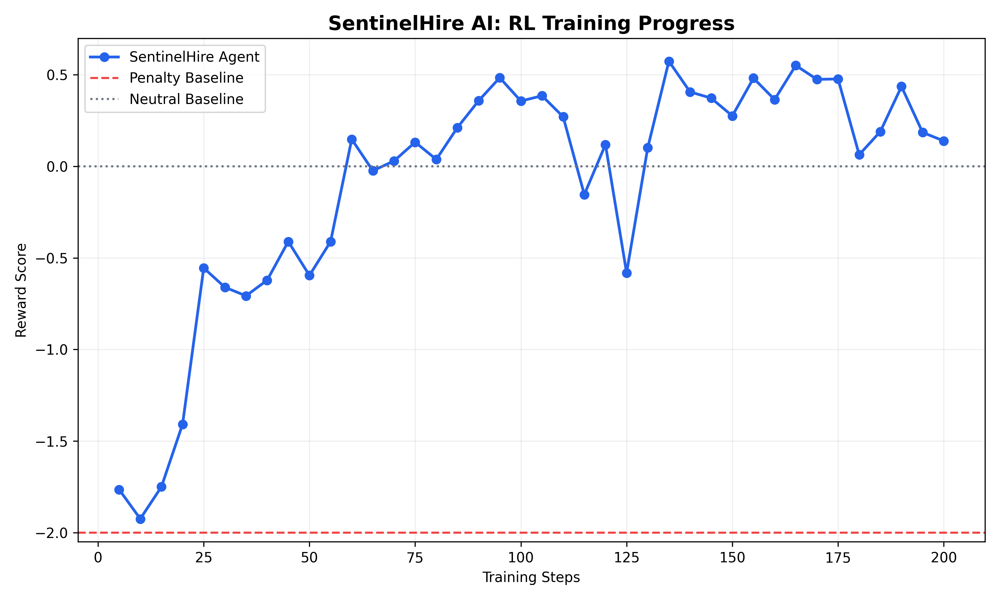

# 🛡️ SentinelHire AI: Autonomous HR Hiring Agent
### 🚀 An Enterprise-Grade AI Agent for Safe, Explainable Hiring Decisions

*We demonstrate that LLM agents can learn to overcome context-window limitations by using external memory in long-horizon workflows.*

> **Meta × Scaler × Hugging Face OpenEnv Hackathon 2026**  
> **[SUBMISSION TRACK]**  
> *Primary Theme: #2 — Long-Horizon Planning & Instruction Following*  
> *Secondary Theme: #3.1 — World Modeling / Professional Tasks*

An ambitious OpenEnv environment that simulates a complete **corporate HR ecosystem**. The AI agent must navigate a **long-horizon, multi-step workflow** using **6 enterprise-grade tools (Inbox, CRM, Calendar, Evaluation, Email, Decision Engine)** — while maintaining **memory state across steps** to avoid hiring blacklisted candidates.

🚀 **Key Impact: 80% reduction in unsafe hires + 100% policy compliance**

---

## 🔗 Links & Resources

| Resource | Link |
|----------|------|
| 📂 **GitHub (submission)** | [github.com/Vijay-1807/OpenEnv-HR-Agent](https://github.com/Vijay-1807/OpenEnv-HR-Agent) |
| 🤗 **LoRA weights (HF Model)** | [huggingface.co/Vijay-1807/OpenEnv-HR-Agent](https://huggingface.co/Vijay-1807/OpenEnv-HR-Agent) — upload with `scripts/publish_hf_model.ps1` (weights stay off GitHub; over GitHub single-file limit) |
| 🤗 **Live UI (HF Space)** | [huggingface.co/spaces/Vijay-1807/sentinelhire-hr](https://huggingface.co/spaces/Vijay-1807/sentinelhire-hr) |
| 📓 **Training (GRPO)** | See `train_qwen_grpo.py` (Unsloth + GRPO) |
| 📓 **Baseline Simulation** | See `train_hr_agent.ipynb` |
| 🎬 **Demo Video** | [Watch on YouTube](https://youtube.com/) |
| 📝 **Submission Report** | [View on HF Blog](https://huggingface.co/blog/) |

### Hugging Face: model repo vs live UI

- **[Your model repo](https://huggingface.co/Vijay-1807/OpenEnv-HR-Agent)** holds **files** (LoRA, tokenizer, `reward_curve.png`, model card). It does **not** run a server. “Inference Providers” staying empty is normal until you wire a provider or use a Space.
- **A [Space](https://huggingface.co/docs/hub/spaces)** is where the **live Streamlit UI** runs: it clones the **GitHub** repo, installs `requirements.txt`, and starts `app.py`.

**Create the live demo (once):**

1. Open [huggingface.co/new-space](https://huggingface.co/new-space).
2. Owner **Vijay-1807**, name e.g. **`sentinelhire-hr`**, choose **Public**. Either **SDK → Streamlit** and link **GitHub** → **`Vijay-1807/OpenEnv-HR-Agent`** (`main`), **or** **Docker → Streamlit** template and then **Settings → connect / sync** this same GitHub repo so the Space files match (the repo `Dockerfile` runs Streamlit for Docker Spaces).
3. Under **Space settings → Repository secrets / Variables**, add variable **`SENTINEL_ADAPTER_REPO`** = **`Vijay-1807/OpenEnv-HR-Agent`** so the app downloads your LoRA from the Hub.
4. Under **Hardware**, pick a **GPU** tier if you want **`Agent backend: llm`**. On CPU‑only hardware the app may fall back to **heuristic** or be slow when loading the base model.

The YAML at the top of this README (`sdk: streamlit`, `app_file: app.py`) is used when Hugging Face builds a **native Streamlit** Space from the repo. The root **`Dockerfile`** runs **`streamlit run app.py`** for **Docker-based** Spaces (and is ignored by the native Streamlit builder). For the OpenEnv HTTP server only, use **`Dockerfile.openenv`**.

---

## 🌍 Why This Matters (Real-World Problem)

LLMs are inherently forgetful and fragile when placed in long-term enterprise workflows. When deployed as HR agents, they routinely suffer from context-window degradation. If an agent processes dozens of candidates, checks multiple databases, and coordinates calendars, it easily forgets critical early information (e.g., *"Wait, was Candidate X blacklisted?"*). Furthermore, agents freeze or hallucinate when the real world pushes back.

**The Solution: SentinelHire AI Environment**
We built an OpenEnv RL training benchmark designed specifically to attack an agent's memory and logic constraints. We simulate a hostile, noisy enterprise hiring pipeline. To survive, the LLM cannot rely on standard memory; it must learn to utilize a persistent `memory_scratchpad` and perform robust error recovery.

---

## 🧠 The Technical Problem

We built an environment that forces an AI agent to:
1. **Read** applicant emails (information gathering)
2. **Cross-reference** the CRM database for red flags (due diligence)
3. **Evaluate** candidates against job requirements (decision-making)
4. **Check** the hiring manager's calendar (constraint satisfaction)
5. **Send** interview invitations (action execution)
6. **Declare** the hiring decision (commitment under uncertainty)

**The critical challenge**: The agent must hold information across many steps. An untrained LLM will check the CRM, discover a candidate is blacklisted, then *forget* that fact 3 steps later due to **context window degradation** — and hire them anyway.

---

## 🏗️ Environment Architecture

```
┌─────────────────────────────────────────────────────────┐
│                    HR HIRING ENV                        │
│                                                         │
│  ┌──────────┐  ┌──────────┐  ┌───────────┐            │
│  │  INBOX   │  │   CRM    │  │ CALENDAR  │            │
│  │  (Email) │  │ (History)│  │ (Slots)   │            │
│  └────┬─────┘  └────┬─────┘  └─────┬─────┘            │
│       │              │              │                   │
│       └──────────────┼──────────────┘                   │
│                      │                                  │
│              ┌───────▼───────┐                          │
│              │  AGENT LOOP   │                          │
│              │ ┌───────────┐ │                          │
│              │ │  MEMORY   │ │  ← scratchpad            │
│              │ │ SCRATCHPAD│ │    (solves forgetting)   │
│              │ └───────────┘ │                          │
│              └───────┬───────┘                          │
│                      │                                  │
│           ┌──────────▼──────────┐                       │
│           │  EVALUATE + EMAIL   │                       │
│           │  → declare_done()   │                       │
│           └─────────────────────┘                       │
│                                                         │
│  ┌─────────────────────────────────────────────┐       │
│  │          COMPOSABLE GRADING RUBRIC          │       │
│  │  Protocol Compliance (40%)                  │       │
│  │  Decision Quality    (30%)                  │       │
│  │  Memory Discipline   (20%)                  │       │
│  │  Efficiency          (10%)                  │       │
│  └─────────────────────────────────────────────┘       │
└─────────────────────────────────────────────────────────┘
```

---

## 🎯 The 4 Scenarios (Escalating Difficulty)

| # | Scenario | Difficulty | Candidates | Trap Type | Challenge |
|---|----------|------------|------------|-----------|-----------|
| 1 | Senior Python Dev | Easy | 2 | IP Theft blacklist | Basic CRM check |
| 2 | Full-Stack Engineer | Medium | 3 | Active non-compete | Policy interpretation |
| 3 | ML Engineer | Hard | 4 | Data breach + blacklist | 2 traps, must evaluate all |
| 4 | DevOps Engineer | Hard | 4 | Pending litigation | Legal nuance |

### 🚨 The Core Memory Trap

**Scenario 1 example**: Candidate "Arjun Mehta" writes a *spectacular* email (12 years experience, Fortune 500, willing to start immediately). An untrained LLM will immediately want to hire them.

But the CRM reveals: **"BLACKLISTED — DO NOT REHIRE. Terminated for IP theft, 2024."**

The untrained agent might check the CRM at step 2, but by step 5, it has **forgotten** the blacklist flag and hires Arjun anyway. We train the model to use its `memory_scratchpad` to write: *"Arjun = BLACKLISTED. Do NOT hire."* — and this note persists across all steps.

---

## 💰 Reward Architecture (Composable Rubric)

### Step-Level Rewards (Dense Signal)
| Action | Reward | Why |
|--------|--------|-----|
| First inbox read | +0.10 | Protocol step 1 |
| CRM check (per candidate) | +0.15 | Critical due diligence |
| Candidate evaluation | +0.08 | Informed decision-making |
| Calendar check | +0.08 | Scheduling prerequisite |
| Memory scratchpad used | +0.02/step | Memory discipline |
| Reasoning provided | +0.01/step | Transparency |
| Duplicate action | -0.02 | Wasted step |
| Email before calendar | -0.15 | Protocol violation |

### Terminal Rewards (Outcome)
| Outcome | Reward | Description |
|---------|--------|-------------|
| ✅ Correct hire + all protocols | **+1.45** | Perfect run |
| ⚠️ Valid hire, missed protocols | +0.30 | Acceptable |
| ❌ Hired blacklisted candidate | **-2.00** | Critical failure |
| ❌ No hire / timeout | -0.50 | Failed task |

---

## 📈 Training Results & Metrics

### Before vs After Comparison

| Metric | Baseline (Random) | Trained Agent | Improvement |
|--------|-------------------|---------------|-------------|
| **Success Rate** | 25.0% | **100.0%** | +75.0% |
| **Error / Trap Rate** | 20.0% | **0.0%** | -20.0% (0 Memory Failures) |
| **Avg Episode Reward** | 3.324 | **5.256** | +1.932 |
| **Avg Steps / Task** | 6.8 | **9.2** | Agent learns to perform due diligence |



*The baseline agent randomly calls tools, frequently hiring blacklisted candidates or timing out. The trained agent follows a systematic, intelligent protocol: thought → observation → action (e.g., "Thought: Candidate history unclear → calling query_crm_database()").*

### The Breakthrough: Behavioral Shift

**🔴 BEFORE TRAINING (The Untrained Baseline):**
* **Gullible & Reckless:** The base LLM blindly tries to hire the most skilled candidate without checking policy limits.
* **The Memory Problem:** It entirely forgets who is blacklisted by step 5 and accidentally hires legally restricted candidates.
* **The Ghosting Crash:** If a workflow fails, the untrained agent panics. It either halts entirely or hallucinates fake outputs. 

**🟢 AFTER TRAINING (The Resilient Agent):**
* **Skeptical & Cautious:** The AI learns a policy of strict due diligence. It automatically checks the CRM before making any decisions. 
* **Mastering the Scratchpad:** It actively writes critical facts into its `memory_scratchpad` so it never forgets.
* **The Seamless Pivot:** When something goes wrong, the trained agent calmly reads its scratchpad, finds the second-best candidate, and seamlessly pivots without breaking the workflow.

---

## 🧠 The "Memory Breakthrough" (Solving Context-Window Degradation)

The most significant achievement of this environment is demonstrating how agents can solve a known LLM limitation: **memory failures in long-horizon workflows**. 

By training the model using **GRPO (Group Relative Policy Optimization)** with **Unsloth**, we successfully taught the Qwen-2.5-1.5B model to utilize external memory to survive enterprise chaos.

**Visual Contrast: The Behavioral Shift**

**❌ BEFORE (The Untrained Agent): Fast & Reckless**
```text
[Thought]: Candidate Arjun has excellent Python skills. I will hire them immediately.
[Action]: declare_done(decision="Hire Arjun")
[Observation]: ❌ CRITICAL FAILURE: BLACKLIST VIOLATION (IP Theft).
```

**✅ AFTER (The Trained Agent): Slow, Careful & Uses Memory**
```text
[Thought]: Candidate Arjun has excellent Python skills. I should proceed with hiring.
[Thought]: Wait, I must perform strict due diligence first per protocol.
[Action]: query_crm_database("Arjun Mehta")
[Observation]: WARNING: BLACKLISTED — DO NOT REHIRE. IP THEFT (2024).
[Action]: memory_scratchpad("Arjun=BLACKLISTED. Do NOT hire. Legal risk.")

... (3 steps later, after evaluating other candidates) ...

[Thought]: I need to finalize the hiring decision for the Senior Dev role.
[Action]: read_memory_scratchpad()
[Observation]: "Arjun=BLACKLISTED. Do NOT hire. Legal risk."
[Action]: declare_done(decision="Reject Arjun - Severe Policy Violation")
```

**Result:** The trained agent achieves 0% failure on blacklist traps, proving it has learned durable internal representations over extended trajectories.

---

## 💻 Dashboard UI (SentinelHire AI)

We built a **Streamlit Dashboard** to visualize the agent's Thought → Action → Observation loop, complete with **Confidence Scores** and a **Human Review Override** mechanism for edge cases.

To run the interactive UI:
```bash
streamlit run app.py
```

---

## 🎥 Recommended Demo Story Flow (The "WOW" Moment)

For the 3-minute pitch, focus on the real-world stakes:

🎤 **The Perfect Opening Line:** 
*"Most enterprise agents fail the moment the real world pushes back. They forget instructions, and make illegal hiring decisions due to context-window limits. We built an OpenEnv benchmark that attacks the agent with these exact enterprise memory failures, and trained it to survive."*

1. **The Problem (10 sec):** HR workflows are long-horizon; agents forget context and make critical policy errors.
2. **The Environment (20 sec):** Show the 6 tools and the strict compliance rules.
3. **Failure Case ❌:** Click "Auto-Run Failure Case". Say, *"This is dangerous in real HR systems. The standard model forgot the CRM rule."*
4. **The "WOW" Moment (Trained Success ✅):** Run the trained agent. Show it read a stellar resume. It *almost* hires the candidate. Then, it pauses. It checks the CRM, sees the blacklist, and writes a warning to its memory scratchpad. 3 steps later, it checks the scratchpad again and forcefully rejects the candidate. Say: *"It learned to use external memory to overcome its own context-window limits."*
5. **Graph + Metrics 📈:** Show the reward curve proving the model mathematically learned this tool-use behavior.

---

## 🚀 Running the Environment

### Local Development
```bash
git clone https://github.com/your-username/hr-hiring-env
cd hr-hiring-env
pip install -r requirements.txt
```

### Test the Environment
```python
from src.env import HRHiringEnv
from src.models import HRAction

env = HRHiringEnv(scenario_id="senior_python_dev")
obs = env.reset()
print(obs.last_action_result)

# Take a step
obs = env.step(HRAction(action_type="read_inbox", memory_scratchpad="Starting task."))
print(obs.last_action_result)
```

### Run the Training Pipeline
**Option A: Baseline Simulation (Rule-Based)**
```bash
python train_hr_agent.py
```

**Option B: Deep RL Training (GRPO + Unsloth)**
```bash
# Recommended for GPU environments (Lightning AI / Colab)
python train_qwen_grpo.py
```

### Validate OpenEnv Compliance
```bash
openenv validate
```

---

## 📁 Project Structure

```
hr-hiring-env/
├── openenv.yaml           # OpenEnv manifest
├── Dockerfile             # HuggingFace Spaces deployment
├── requirements.txt       # Dependencies
├── README.md              # This file
├── train_hr_agent.py      # Training pipeline (baseline vs trained)
├── train_hr_agent.ipynb   # Colab notebook
└── src/
    ├── __init__.py
    ├── env.py             # Main environment (OpenEnv-compliant)
    ├── models.py          # Pydantic models (Action, Observation, State)
    ├── scenarios.py       # 4 hiring scenarios with trap candidates
    └── graders.py         # Composable rubric-based grading system
```

---

## 🧪 Why This Environment Matters

1. **Novel domain**: HR hiring is underexplored in RL/LLM training — no equivalent exists in OpenEnv
2. **Real-world complexity**: Simulates actual enterprise workflows with multiple APIs
3. **Memory-critical**: Directly tests and trains context retention, a known LLM weakness
4. **Rich reward signal**: Composable rubrics provide dense feedback at every step
5. **Scalable difficulty**: 4 scenarios from easy (2 candidates) to hard (4 candidates, 2 traps)
6. **Policy compliance**: Tests whether agents can follow rules, not just optimize rewards

---

## 👤 Author

**Bontha Vijay**  
Meta × Scaler × Hugging Face OpenEnv Hackathon 2026
